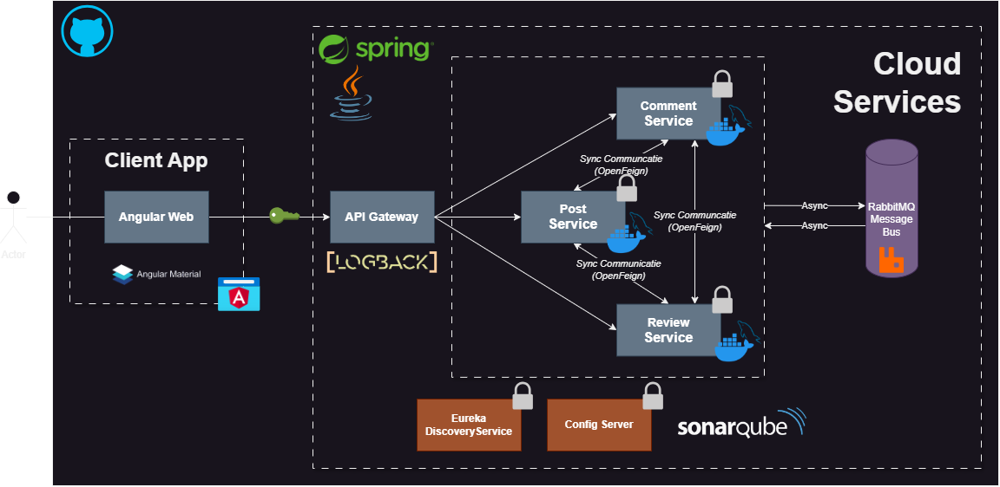

# Architecture

# Class Diagram

# Overzicht van de Architectuur

## 1\. Client Applicatie

-   **Frontend**: De frontend is een webapplicatie gebouwd met Angular en Angular Material. Deze applicatie wordt door de eindgebruikers benaderd om interacties uit te voeren.
-   **Communicatie met API Gateway**: De frontend communiceert met de API Gateway voor alle backend-functionaliteiten.

## 2\. API Gateway

-   **Functie**: De API Gateway is de centrale toegangspoort voor de frontend om met de backend microservices te communiceren. Het zorgt voor het routeren van verzoeken.
-   **Logback Logging**: Logback is geïntegreerd in de API Gateway voor gecentraliseerde logging, wat helpt bij het monitoren en debuggen van de applicatie.

## 3\. Microservices

### Belangrijkste Services:

-   **Comment Service**: Beheert het toevoegen en beheren van reacties.
-   **Post Service**: Beheert het posten van berichten.
-   **Review Service**: Beheert reviews en beoordelingen.

### Kenmerken van de Microservices:

-   **Synchronous Communication**: Alle microservices hebben een synchrone communicatie onderling, wat betekent dat ze direct gegevens uitwisselen wanneer er een verzoek wordt verzonden.
-   **Asynchronous Communication via RabbitMQ**: Bepaalde taken worden asynchroon uitgevoerd via RabbitMQ, een berichtensysteem.

## 4\. Service Discovery en Configuratie

-   **Eureka Discovery Service**: Deze service houdt een lijst bij van beschikbare microservices en helpt bij het automatisch ontdekken van services binnen de infrastructuur.
-   **Config Server**: Beheert de configuraties van alle microservices centraal, wat versiebeheer en beheer van instellingen vergemakkelijkt.

## 5\. Cloud Services

-   **RabbitMQ Queue**: Wordt gebruikt voor asynchrone berichtenuitwisseling tussen de microservices. Dit zorgt voor losgekoppelde communicatie. Voor asynchrone communicatie, bijvoorbeeld om notificaties (zoals bij US8) te sturen zonder dat de services direct afhankelijk van elkaar zijn.Dit betekent dat als bijvoorbeeld de ReviewService een post wil goedkeuren, het informatie over die post kan ophalen van de PostService via OpenFeign. Deze REST-communicatie is nodig omdat de ReviewService en PostService als losse onderdelen in een microservices-architectuur draaien en geen directe toegang hebben tot elkaars data. OpenFeign maakt het eenvoudig om API-aanroepen tussen de services te doen zonder extra complexe code.
-   **Open-Feign**: Voor het opzetten van REST-communicatie tussen de services.
-   **SonarQube**: SonarQube is geïntegreerd om de codekwaliteit en security vulnerabilities van de backend-code te analyseren en monitoren.

# Link met User Stories

### 1\. PostService

-   **US1**: Redacteuren kunnen posts aanmaken.
-   **US2**: Posts kunnen als concept worden opgeslagen.
-   **US3**: Redacteuren kunnen posts bewerken.
-   **US4**: Gebruikers zien een overzicht van gepubliceerde posts.
-   **US5**: Posts zijn te filteren op inhoud, auteur en categorie.

### 2\. ReviewService

-   **US7**: Hoofdredacteur kan posts goedkeuren of afwijzen.
-   **US8**: Redacteuren ontvangen meldingen bij goedkeuring of afwijzing.
-   **US9**: Redacteuren kunnen feedback geven bij afwijzing.

### 3\. CommentService

-   **US10**: Gebruikers kunnen reageren op posts.
-   **US11**: Gebruikers kunnen reacties van anderen lezen.
-   **US12**: Gebruikers kunnen hun eigen reacties bewerken of verwijderen.